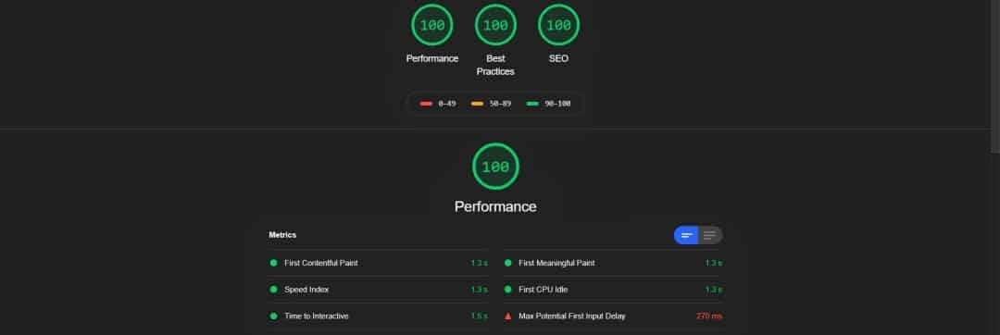

# 🎉 Vue Cursor Fx

[![Code Quality][quality-src]][quality-href]
[![Downloads][npm-downloads-src]][npm-downloads-href]
[![Dependencies][dependencies-src]][dependencies-href]
[![Version][npm-version-src]][npm-version-href]
[![Donate][paypal-donate-src]][paypal-donate-href]

[quality-src]: https://img.shields.io/badge/code%20quality-A-informational?style=flat
[quality-href]: https://luxdamore.github.io/vue-cursor-fx/

[npm-downloads-src]: https://img.shields.io/npm/dt/@luxdamore/vue-cursor-fx.svg?style=flat&color=darkgreen
[npm-downloads-href]: https://npmjs.com/package/@luxdamore/vue-cursor-fx

[dependencies-src]: https://img.shields.io/badge/dependencies-up%20to%20date-darkgreen.svg?style=flat
[dependencies-href]: https://npmjs.com/package/@luxdamore/vue-cursor-fx

[npm-version-src]: https://img.shields.io/npm/v/@luxdamore/vue-cursor-fx/latest.svg?style=flat&color=darkorange&label=version
[npm-version-href]: https://npmjs.com/package/@luxdamore/vue-cursor-fx

[paypal-donate-src]: https://img.shields.io/badge/paypal-donate-black.svg?style=flat
[paypal-donate-href]: https://www.paypal.me/luxdamore
[patreon-donate-href]: https://www.patreon.com/luxdamore
[kofi-donate-href]: https://ko-fi.com/luxdamore

> An animated custom cursor effects for interactive elements like navigation - w/ VueJS - SSR Compatible

## Installation

This package is available on `npm` and `yarn`.

```bash

    # Deps
    npm install --save @luxdamore/vue-cursor-fx

    # Or
    yarn add @luxdamore/vue-cursor-fx

```

### Usage

#### As component

```js

    // Global component and css
    import { CursorFx } from '@luxdamore/vue-cursor-fx';
    import '@luxdamore/vue-cursor-fx/dist/CursorFx.css';

    // Install
    Vue.component(
        CursorFx.name,
        CursorFx
    );


    // Or, in a .vue file
    import { CursorFx } from '@luxdamore/vue-cursor-fx';

    export default {
        components: {
            'cursor-fx': CursorFx,
        },
    };

    <style src="@luxdamore/vue-cursor-fx/dist/CursorFx.css"></style>

```

#### As a global plugin

```js

    // Plugin
    import CursorFx from '@luxdamore/vue-cursor-fx';
    import '@luxdamore/vue-cursor-fx/dist/CursorFx.css';

    // Install
    Vue.use(
        CursorFx
    );

```

#### Browser's way

```html

    <!doctype html>
    <html>
        <head>

            <!-- CursorFx styles -->

            <!-- Old way -->
            <link rel="stylesheet" href="https://unpkg.com/@luxdamore/vue-cursor-fx@latest/dist/CursorFx.css" />
            <!-- end old way -->

            <!-- New way -->
            <link rel="preload" href="https://unpkg.com/@luxdamore/vue-cursor-fx@latest/dist/CursorFx.css" as="style" onload="this.rel='stylesheet'" />
            <link rel="preload" href="https://unpkg.com/@luxdamore/vue-cursor-fx@latest/dist/CursorFx.umd.min.js" as="script" />
            <!-- end new way -->

            <!-- end CursorFx styles -->

        </head>
        <body>

            <!--
                Others script (ex. VueJs) and html.
            -->

            <!-- CursorFx script -->
            <script src="https://unpkg.com/@luxdamore/vue-cursor-fx@latest/dist/CursorFx.umd.min.js"></script>
            <!-- end CursorFx script -->

        </body>
    </html>

```

#### Markup

_Use one time in the main file of your project or in every views, where you want it._

```html

    <button
        type="button"
        title="Special button"
        data-cursor-hover
    >
        Add `data-cursor-hover` to an every html elements that you want to see the cursor bigger on hover
    </button>

    <button
        type="button"
        title="Special button"
        data-cursor-hidden
    >
        Add `data-cursor-hidden` to an every html elements that you want to hide the cursor on hover
    </button>

    <button
        type="button"
        title="Special button"
        data-cursor-hover
        data-cursor-mix-blend-mode="difference"
    >
        Add `data-cursor-mix-blend-mode` to an every html elements that you want to change the mix-blend-mode type.
    </button>

    <cursor-fx />

```

### Options

_N.B.: the cursor is not activated on touchscreen devices._

#### Slots

```bash

    # Available
    slot="default"  # Add some content in the middle of the cursor

```

#### Events

```html

    <cursor-fx
        @before-start="onBeforeStart"
        @after-start="onAfterStart"
        @ready="onReady"
        @before-destroy="onBeforeDestroy"
        @after-destroy="onAfterDestroy"
    ></cursor-fx>

```

#### Props

| Attribute | Type | Default value | About |
|:--------------------:|--------------------|:-------:|-------------------------------------|
| config | Object | {} | The default options applied to cursor, see below the `BASE_CONFIG` |
| color | String | #333333 |Color for the cursor |
| color-hover | String | #333333 | Color, on hover, for the cursor |
| outside-size | String | null | The size of outer circle |
| inside-size | String | null | The size of inner dot |
| shape | String | null | Only available shapes are `circle` and `square` |
| delay | String, Number | 60 | Activate cursor after x seconds |
| mix-blend-mode | String | null | Set the global `mix-blend-mode` style |
| force-custom-slot | Boolean | false | Show or hide the internal default slot |
| allow-on-mobile | Boolean | false | Allow the cursor on mobile devices |
| hide-outside | Boolean | false | Hide outer circle |
| hide-inside | Boolean | false | Hide inner dot |
| disabled | Boolean | false | Disable the activation of the cursor |

```js

    const BASE_CONFIG = {
        lerps: {
            dot: 1,
            circle: 0.18,
            custom: 0.23,
        },
        scale: {
            ratio: 0.18,
            min: 0.5,
            max: 1,
        },
        opacity: 0.1,
    };

```

#### Methods

```html

    <!-- component.vue -->
    <template>
        <div>

            <!-- start it, later -->
            <cursor-fx ref="cursor" disabled />

        </div>
    </template>

    <!-- Component -->
    <script>
        export default {
            mounted() {

                // start it, on mounted, or wherever you want
                this.$refs.cursor.start();

            },
            methods: {
                others() {

                    // destroy
                    this.$refs.cursor.destroy();

                    //-> refresh automate: `destroy()` and `start()`
                    this.$refs.cursor.refresh();

                },
            }
        },
    </script>

```

#### Integrations

##### VueRouter

```html

    <!-- App.vue -->
    <template>
        <div>

            <router-view></router-view>

            <cursor-fx />

        </div>
    </template>

```

##### NuxtJs

- For the entire website: place the component in the desired layouts (ex. layouts/default.vue);
- For some pages only: place the component in the desired pages (ex. pages/index.vue).

```html

    <!-- layout/default.vue -->
    <template>
        <div>

            <main>
                <nuxt />
            </main>

            <cursor-fx />

        </div>
    </template>

```

___

## 👩🏻‍💻👨🏻‍💻 Development

1. **Clone** the repository:
   - `git clone https://github.com/LuXDAmore/vue-cursor-fx.git`;
2. **Install** dependencies:
   - `yarn install` (or `npm install`);
3. **Start** a development server:
   - `yarn dev` (or `npm run dev`);
4. **Extra**, build the documentation ([*Github Pages*](https://pages.github.com/)):
   - `yarn build` (or `npm run build`);
   - _the content is automatically generated into the `/docs` folder_.

## 🐞 Issues

Please make sure to read the [**issue reporting checklist**](./.github/ISSUE_TEMPLATE/bug_report.md) before opening an issue.
*Issues not conforming to the guidelines may be closed immediately*.

## 📝 Discussions

We're using [**Github discussions**](https://github.com/LuXDAmore/vue-cursor-fx/discussions) as a place to connect with other members of our community.
*You are free to ask questions and share ideas, so enjoy yourself*.

## 👥 Contribution

Please make sure to read the [**contributing guide**](./.github/ISSUE_TEMPLATE/feature_request.md) before making a pull request.

## 📖 Changelog

Details changes for each release are documented in the [**release notes**](./CHANGELOG.md).

### 🆓 License

[MIT License](./LICENSE) // Copyright (©) 2019-now [Luca Iaconelli](https://lucaiaconelli.it)

#### 💼 Hire me

[](https://curriculumvitae.lucaiaconelli.it)

#### 💸 Are you feeling generous today?

If You want to share a beer, we can be really good friends 😄

__[Paypal][paypal-donate-href] // [Patreon][patreon-donate-href] // [Ko-fi][kofi-donate-href]__

> ☀ _It's always a good day to be magnanimous_ - cit.

___

#### 💡 Lighthouse



___

#### 💘 Inspired by

[CustomCursors by Tympanus](https://tympanus.net/Tutorials/CustomCursors/index3.html)
